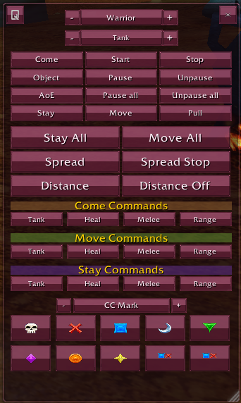
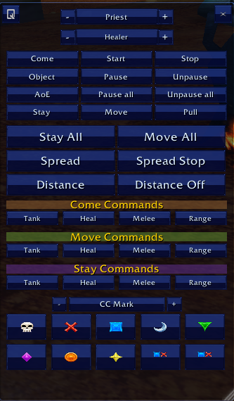
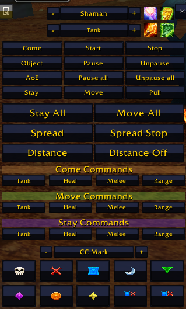
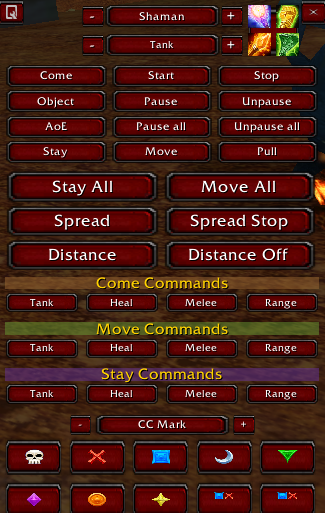
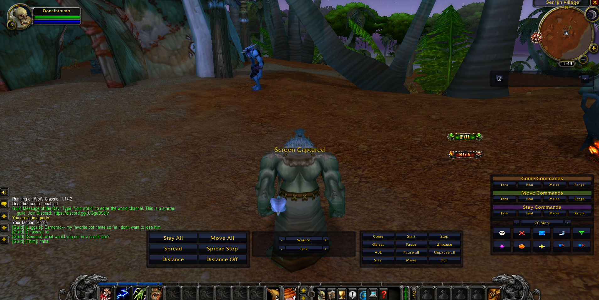
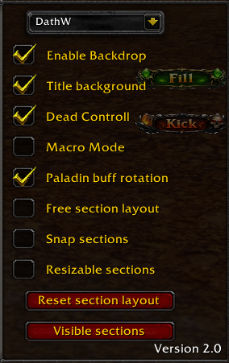

# PCPRemake

[](https://github.com/pumpan/pcpremake/releases)


[](https://github.com/pumpan/pcpremake/releases)
[](https://github.com/pumpan/pcpremake/releases/latest)
<a href="https://www.paypal.com/donate/?hosted_button_id=JCVW2JFJMBPKE" target="_blank">
    
</a>
<a href="https://www.paypal.com/donate/?hosted_button_id=JCVW2JFJMBPKE" class="paypal-button" target="_blank">
    💙 Buy me a coffee – support the addon
</a>


## 📋 Table of Contents
- [Overview](#overview)
- [Features](#features)
- [Installation](#installation)
- [Usage](#usage)
- [Changelog](#changelog)

## 📝 Overview

This addon is a remake of the **PartyBot Command Panel (PCP)** for **World of Warcraft (WoW) 1.12.1 and 1.14.2**. It is more customizable than the original addon and introduces new features, including the ability to control bots when you are dead. Additionally, it replaces text-based target markers with sorted icons for a more intuitive experience.

## ✨ Features

### 🎮 Gameplay & Bot Control
- **Control Bots When Dead**
  - Maintain full control even after your character dies

- **Macro Mode**
  - Buttons insert commands into the macro window instead of sending them :contentReference[oaicite:0]{index=0}
  - Perfect for building macros quickly

---

### 🧙 Class-Specific Systems

#### Paladin
- Automatic **Blessing rotation system**
- Each new Paladin gets the next blessing (BoK → BoM → BoW → BoL → BoS)
- Current blessing is shown directly on the spawn button
- Toggleable in settings

#### Shaman
- Full **Totem system**
- 4 independent slots:
  - Air / Earth / Fire / Water
- Visual 2x2 icon layout on the button
- Quick-change per slot (right-click)
- Live updates (icons + tooltip)

---

### 🎨 UI & Visuals

- **Themes**
  - Multiple built-in styles (DathW, DarkGlass, WarcraftGold, etc.)
  - Gradient buttons with hover effects
  - Subtle animated gradients for a more “alive” UI

<p align="center">
  
  
  
  
  <br>
  <em>(Not showing all themes)</em>
</p>

- **Icon-based UI**
  - Clean interface using icons instead of text
  - Context-aware buttons (changes based on class)

- **Improved Tooltips**
  - Dynamic & context-aware
  - Updates live when changing settings

---

### 📐 Layout & Customization

<p align="center">
  
  <br>
</p>

- **Resizable Frame**
  - Drag the bottom-right corner to resize the panel

- **Free Section Layout**
  - Hold **ALT + drag** to move sections
  - Optional snap-to-grid system
  - Save custom layouts

- **Resizable Sections**
  - Resize individual sections independently

---

### ⚙️ Settings & Control

<p align="center">
  
</p>

- **Live Settings (no reload required)**
- Options include:
  - Macro Mode
  - Paladin rotation
  - Free layout
  - Snap layout
  - Resizable sections

- **Click-outside-to-close settings**
- Settings always appear above other addons

---

### 🧱 Panel & Behavior

- **Backdrop and Title Background**
  - Toggle background and section titles (Come / Move / Stay)

- **New Minimap Button**
<p align="center">
  
</p>

- **Reset Frame Position**
  - Command:
    ```
    /movepcp
    ```
  - Moves the panel to your cursor if it goes off-screen

---

### 🔧 Improvements Over Original PCP

- Fully rewritten in **Lua (no XML)**
- Dynamic UI system (resizing, layout, live updates)
- Icons instead of text for CC marks and focus targets
- Cleaner and more modern interface
- Removed unnecessary buttons (Add Random, etc.)
- Improved button placement and usability
## 🛠️ Installation

1. **Download the Addon:**
    
👉👉👉[](https://github.com/pumpan/pcpremake/releases)👈👈👈

3. **Extract Files:**  
   - Extract the contents to your WoW addons directory, typically located at:  
     ```
     World of Warcraft/Interface/AddOns
     ```
   - Rename the folder to `PCP`.

4. **Enable the Addon:**  
   - Launch WoW and go to the AddOns menu from the character selection screen.  
   - Ensure that the addon is enabled in the list.

## 🚀 Usage

1. **Open the PartyBot Command Panel:**  
   - Click the icon on the minimap.

## 📅 Changelog
---

### 🚀 PCPRemake 2.0.0

> Major overhaul – PCP is now a fully dynamic and customizable UI system

---

### ✨ New Features

#### 🎮 Gameplay & Systems
- Added **Macro Mode**
  - Buttons insert commands into macro window instead of sending them :contentReference[oaicite:0]{index=0}
- Added **Paladin Blessing Rotation system**
  - Automatically cycles blessings when adding Paladins
- Added full **Shaman Totem system**
  - 4 independent totem slots (Air / Earth / Fire / Water)
  - Visual 2x2 icon layout
  - Quick-change per slot

---

#### 🎨 UI & Visuals
- Added **full theme system**
  - Multiple styles (DathW, WarcraftGold, etc.)
- Added **gradient buttons**
- Added **hover effects & pressed states**
- Added **subtle animated gradients**
- Switched to **icon-based UI**

---

#### 📐 Layout System
- Added **Free section layout**
  - ALT + drag to move sections
- Added **snap-to-grid system**
- Added **resizable sections**
- Added **separate controls section (settings + close)**

---

#### ⚙️ Settings & UX
- Added **live settings (no reload required)**
- Added **click-outside-to-close settings**
- Fixed settings appearing under other addons
- Improved settings layout (dynamic sizing)

---

### 🔧 Improvements

- Fully **rewritten UI in Lua** (removed XML)
- Improved **performance & rendering**
- Improved **tooltip system**
  - Dynamic & context-aware
- Improved **button styling & borders**
- Improved **class-based UI behavior**
- Improved **layout stability**
- Improved **theme switching (live updates)**

---

### 🧹 Changes

- Removed outdated UI limitations from original PCP
- Cleaned up button logic and layout handling
- Simplified user interaction (fewer unnecessary buttons)

---

### 🐛 Fixes

- Fixed theme/gradient issues on reload
- Fixed UI layering issues (frames appearing behind others)
- Fixed layout inconsistencies when resizing
- Fixed button overlap & scaling issues
- General stability fixes

---

### PCPRemake 1.2.0

#### ✨ Added by sinnerman
- Added **Macro Mode** (buttons insert commands into macro window instead of sending them).

#### 🔧 Changed
- Replaced direct `SendChatMessage` calls with `DispatchCommand` for:
  - Commands
  - Pause / Unpause
  - Mark functions


**PCPRemake 1.1.0**  

    🛠 Improvements: Fixed unpause all button wich wasnt working if you had a target.e.   
**PCPRemake 1.0.0**  

    🆕 **NEW:** First release.


