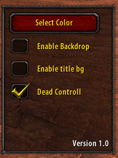

# PCPRemake


## 📋 Table of Contents
- [Overview](#overview)
- [Features](#features)
- [Installation](#installation)
- [Usage](#usage)
- [Changelog](#changelog)

## 📝 Overview

This addon is a remake of the **PartyBot Command Panel (PCP)** for **World of Warcraft (WoW) 1.12.1**. It is more customizable than the original addon and introduces new features, including the ability to control bots when you are dead. Additionally, it replaces text-based target markers with sorted icons for a more intuitive experience.

## ✨ Features

- **Resizable Frame:**
  - Resize the frame to better fit your screen by dragging the handle in the bottom-right corner.

- **Themes:**
  - Choose from various themes to customize the panel's appearance.

<p align="center">
  
  
  
  <br>
  <em>(Not showing all themes)</em>
</p>

<p align="center">
  
</p>

- **Backdrop and Title Background:**
  - Choose whether to display a backdrop behind the command panel and a background for the titles (like "Come Commands," "Stay Commands," "Move Commands").

- **Control Bots When Dead:**
  - Maintain control of bots even when your character has died.

- **Reset Frame Position:**
  - Use the command:  
    ```
    /pcp move
    ```
    This moves the PCP frame to your cursor, resolving an issue from the original addon where the frame sometimes appeared off-screen.

- **Other Improvements Over the Original Addon:**
  - Icons instead of text for CC marks and focus targets, sorted in the same order as when marking a target.
  - Removed the "Add" button; now you add a bot by clicking the "role button" (e.g., "Tank").
  - Removed the "Add Random" button (it seemed unnecessary to add a random bot).

## 🛠️ Installation

1. **Download the Addon:**  
   - Clone this repository or download the ZIP file from GitHub.

2. **Extract Files:**  
   - Extract the contents to your WoW addons directory, typically located at:  
     ```
     World of Warcraft/Interface/AddOns
     ```
   - Rename the folder to `PCP`.

3. **Enable the Addon:**  
   - Launch WoW and go to the AddOns menu from the character selection screen.  
   - Ensure that the addon is enabled in the list.

## 🚀 Usage

1. **Open the PartyBot Command Panel:**  
   - Click the icon on the minimap.


## 📅 Changelog

**PCPRemake 1.0.0**  
🆕 **NEW:** First release.


